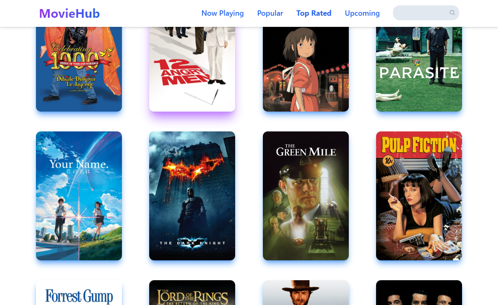
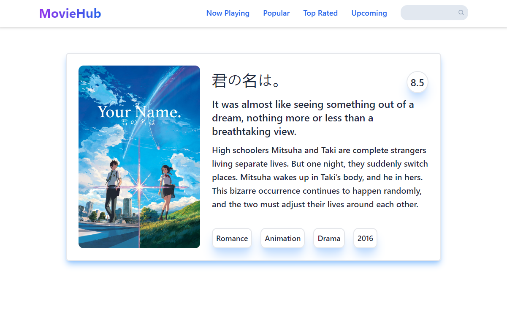

# MovieHub - Your Ultimate Movie Database App

MovieHub is a React project that's perfect for anyone who loves movies. It taps into TMDB API to fetch all sorts of movie details. Whether you're looking for what's currently showing, the most talked-about films, or just want to search for a movie you're interested in, MovieHub makes it easy.

## Features

MovieHub offers an array of features to enhance your movie exploration:

- **Now Playing**: Catch the current box office hits.
- **Popular Picks**: See what films are trending.
- **Top Rated**: Explore highly-rated movies.
- **Search Bar**: Easily search the TMDB database.
- **Movie Details**: Get the details with a click.

## Technologies Used

- **React**: For building the user interface.
- **React Router**: For app navigation.
- **Tailwind CSS**: For styling.
- **JavaScript**: For functionality.
- **React Query**: For data fetching.
- **Vite**: For fast development.
  
## Screenshots




## Getting Started

To get started with the project, follow these steps:

1. **Clone the repository:**

   ```sh
   git clone https://github.com/ozergklp/MovieHub.git
   cd MovieHub
2. **Install dependencies:**

   ```sh
   npm install
3. **Start the development server:**

   ```sh
   npm run dev ---- 
